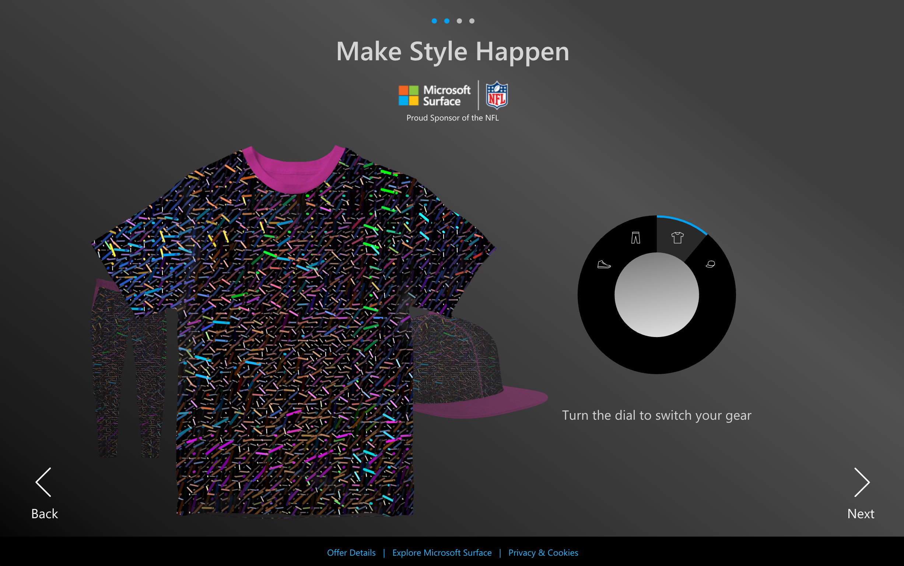

## Project Case Studies
A look at some of the projects that I have worked on and am proud of.

### Qronicles of Invention (Qualcomm)

A patent timeline visualization that shows of Qualcomms large patent portfolio.<br />
***Challenge:** Visualizing 30,000+ patents in a website.*

##### Approach
- Map out the patent data when building the site
- Only draw a limited number of patents at a given moment

*tools: Javascript, D3.js, WebWorkers, PHP, Node.js, Sql*

##### Sample:
```javascript
/// -- BUILD HELPER ARRAYS --
/// Build map of initial size/area of each year in graph.
yearSize = [];
sortedData.forEach(function(d,i) {
    if (!yearSize[d.year]) {
        yearSize[d.year] = 0;
    }
    yearSize[d.year] += +d.size * +d.size;
});

/// Build a map of matrices per year. A matrix is a 2 dimensional set of slots containing "true".
blockMatrix = [];
yearSize.forEach(function(v,k) {
    // First, the columns.
    blockMatrix[k] = _.range(Math.ceil(v/rows)).map(function() {
        // Then, the rows.
        return _.range(rows).map(function() {
            return true;
        });
    });
});

/// -- Sort Data into helper array --
/// Find positions for all patents accounting for patent sizes.
sortedData.forEach(function(d,i) {

    // get minimum year for future calculations.
    if (d.year < minYear) {
        minYear = d.year;
    }

    var found = false;
    for (var c = 0; c < blockMatrix[d.year].length; c++) {
        var column = blockMatrix[d.year][c];
        if (found) {
            break;
        }

        for (var r = 0; r < column.length; r++) {
            var row = column[r];
            if (found) {
                break;
            }

            if (row === true) {
                var clear = true;
                for (var x = 0; x < d.size; x++) {
                    if (!clear) {
                        break;
                    }
                    for( var y = 0; y < d.size; y++) {
                        if (!clear) {
                            break;
                        }
                        if (blockMatrix[d.year][c+x]) {
                            if (blockMatrix[d.year][c+x][r+y]) {
                                continue;
                            } else {
                                clear = false;
                                break;
                            }
                        } else { // Add an Extra Column
                            var column = _.range(rows).map(function() { return true; });
                            blockMatrix[d.year].push(column);
                        }
                    }
                }

                if (clear) {
                    //winner
                    found = true;
                    d.placement.column = c;
                    d.placement.row = r;
                    for (var x = 0; x < d.size; x++) {
                        for (var y = 0; y < d.size; y++) {
                            if (y == 0 && x == 0) {
                                blockMatrix[d.year][c][r] = d;
                            } else {
                                blockMatrix[d.year][c+x][r+y] = false;
                            }
                        }
                    }

                }

            }
        }
    }
});
```

<br />

-----

<br />

### Design Census 2017 (AIGA)

A survey that captures the current state of the design community at large.<br />
***Challenge:** Create a survey that collects meaningful and qualified data, that was has a custom look and feel.*

##### Approach
- Create a custom form since 3rd party providers didn't allow enough customization
- Push data to 3rd party for quick analysis and backup
- Use node.js with login APIs (Google, Twitter, AIGA)

*tools: Javascript, Node.js, Sass, jQuery*<br />
[Design Census - Survey](https://designcensus.sosolimited.com/phasetwo)
[Design Census - Drawers](https://designcensus.sosolimited.com/phasetwo)

##### Sample:
```js
/// Drawer Mechanics
///========================
// drawer elements with show-info attr add a click event
$('[show-info]').on('click', function(e) {

    // target drawer element
    var drawId = $(this).attr('show-info');

    // check if current drawer is already open
    var alreadyOpen = $(this).hasClass( "open" );
    var alreadyOpenMobile = $(this).hasClass( "open-mobile" );

    // DESKTOP DRAWERS
    // if open do nothing
    if (!alreadyOpen) {
        // Fade out any open drawers.
        $('.desktop-drawer .drawer.open').fadeOut("fast", function() {

            // When finished animate the new drawer open and handle open class.
            $('.desktop-drawer .drawer.open').removeClass("open");
            $('#' + drawId).addClass('open');
            $('.desktop-drawer .drawer.open').fadeIn("fast");

            // Handle sliding drawers
            $('.sliding-content-drawer').trigger("sticky_kit:detach");
            var sliderDrawer = $('#' + drawId).parent('.sliding-content-drawer').get(0);
            $(sliderDrawer).stick_in_parent({ 'offset_top': navHeight });
        });

        // adding the open class to the drawer face controls the color and italics.
        $('.drawer-face.open').removeClass("open");
        $(this).addClass("open");
    }

    // MOBILE DRAWERS - slight different as they live in the drawer-face div
    var mobileDrawer = $(this).find('.drawer');

    // We will always be able to close a mobile drawer.
    $('.drawer-face.open-mobile .drawer').slideUp("fast");
    $('.drawer-face.open-mobile').removeClass("open-mobile");

    // only open a drawer if it isn't already open.
    if (!alreadyOpenMobile) {
        mobileDrawer.slideDown("fast");
        $(this).addClass("open-mobile");
    }

    e.preventDefault();
});
```

<br />

-----

<br />

### Who's Got Next (Samsung)

An interactive quiz game that was used at a promotional event.<br />
***Challenge:** Create elaborate animations that make the experience feel less like a website and more like a custom application.*

##### Approach
- Come up with compelling animation in AE that match company branding
- Translate animations to javascript and css

*tools: Adobe After Effects, BodyMovin.js(now Lottie by AirBnb), Javascript, SVGs*

<br />

-----

<br />

### Make Style Happen (Microsoft)

An Instagram campaign/contest that allowed users to create custom clothing designs.<br />
***Challenge:** Recreate Surface Dial behaviors on the web for touch and mouse.*

##### Approach
- Capture mouse and touch events on D3 object.
- Translate (x,y) movement to angular movement.

*tools: D3.js, Vue.js, CSS*

```js
// Dial touch functionality
// ========================
function dragstarted(d) {
  that.d3.dialRotation = 0;
  that.dragFlag = false;
}

function dragged(d) {
  that.dragFlag = true;
  const x = d3Event.x;
  const y = d3Event.y;
  const prevX = x - d3Event.dx; // previous position
  const prevY = y - d3Event.dy; // previous position

  // calculate the angle on the circle and convert from rad to deg
  const currentAngle = Math.atan2(y, x) * 57.2957795;
  const previousAngle = Math.atan2(prevY, prevX) * 57.2957795;

  let diffAngle = 0;

  // Since we are using atan2 we need to account for crossing
  // the limit of atan2 at PI, so if x is negative and y flips signs
  if (y*prevY < 0 && x < 0) {
    // get the sign of the change based on the greater angle
    const sign = currentAngle < previousAngle ? 1 : -1;
    // The absolute value diff of the two angles and corrected for direction with the sign
    diffAngle = ((180 - Math.abs(currentAngle)) + (180 - Math.abs(previousAngle))) * sign;
  } else {
    // simple diff
    diffAngle = currentAngle - previousAngle;
  }

  // add the difference to the current rotation
  let deg = that.getCurrentRotation(d3.select(this)) + diffAngle;

  // set angle of rotation on dial
  d3.select(this).attr("transform", "rotate(" + deg + ")");

  // get the distance need to rotate to change the dial.
  const dist = that.d3.itemArcAngle;

  // update the amount rotate with the current change
  that.d3.dialRotation += diffAngle;

  // if the rotation is greater than the distance
  // increment the dial selection up or down
  if (that.d3.dialRotation > dist) {
    // increment up...
    that.incrementDialUp();
    that.d3.dialRotation = 0;
  }
  if (that.d3.dialRotation < (-dist)) {
    // increment down...
    that.incrementDialDown();
    that.d3.dialRotation = 0;
  }

}

function dragended(d) {
  if (!that.dragFlag) {
    // Dial Click!
    that.incrementDialUp(true);
  }
}
```

<br />

-----

<br />

### Envelope Tracking (Qualcomm)

A dashboard application used to help visualize cellular network improvements.<br />
***Challenge:** Create a polished dashboard map app that also works offline.*

##### Approach
- Create a modular dashboard with an internal state
- Use online/connected map apis and libraries
- Transition to locally hosted map server

*tools: mapbox-gl.js, Vue.js, Tessera(map server), OpenStreetMaps*

<br />

-----

<br />

### Creative Thinking (personal)

A fun visualization of brain activity.<br />
***Challenge:** Integrate EEG sensor and DSLR camera into a stylized visualization.*

##### Approach
- Use C++ libraries to capture data from EEG sensor and raw pictures from the camera
- Stylize and visualize data in Openframeworks (C++)
- Use a stencil and watercolor GLSL(OpenGl Shader Language) effect for visualization

*tools: Openframeworks, C++, OpenGl, DSLR camera, NeuroSky EEG sensor*