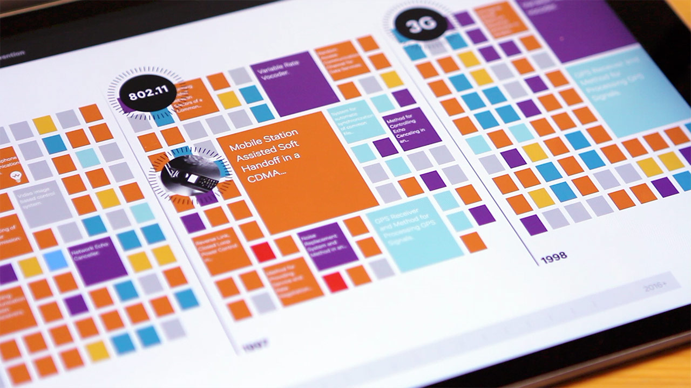
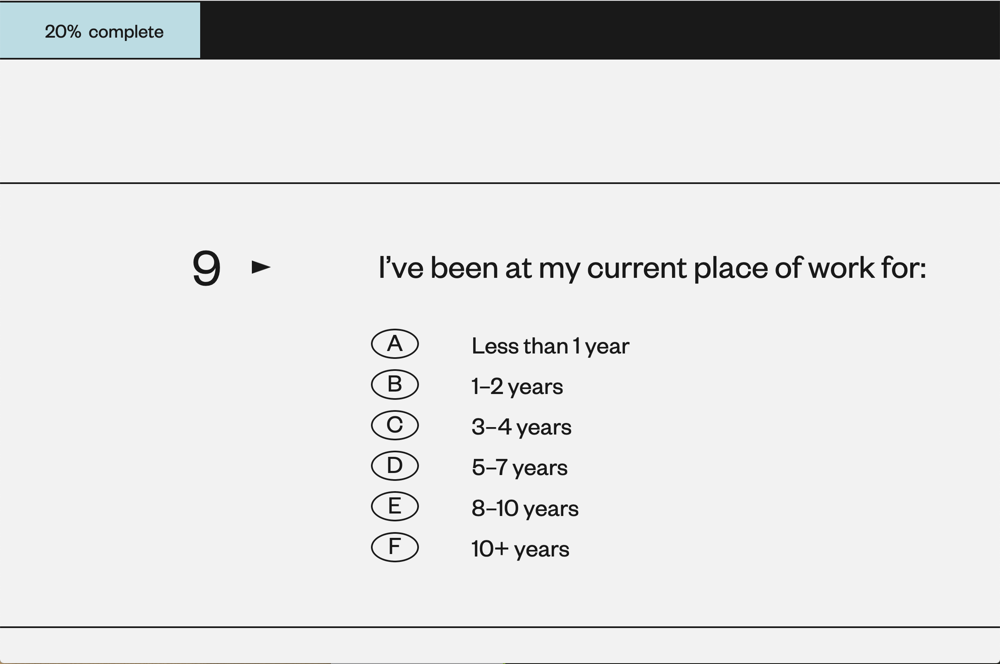
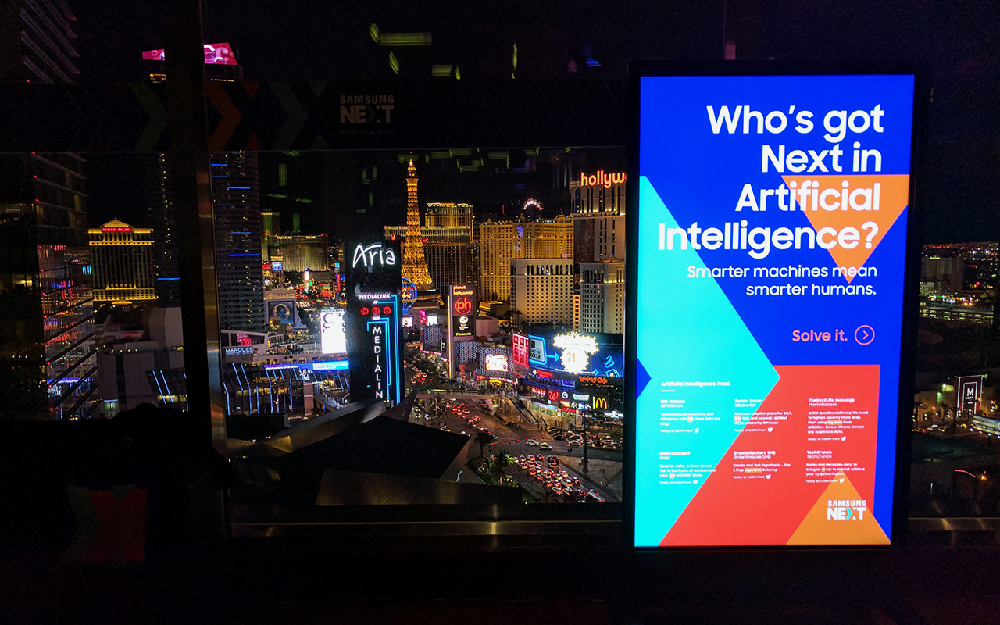
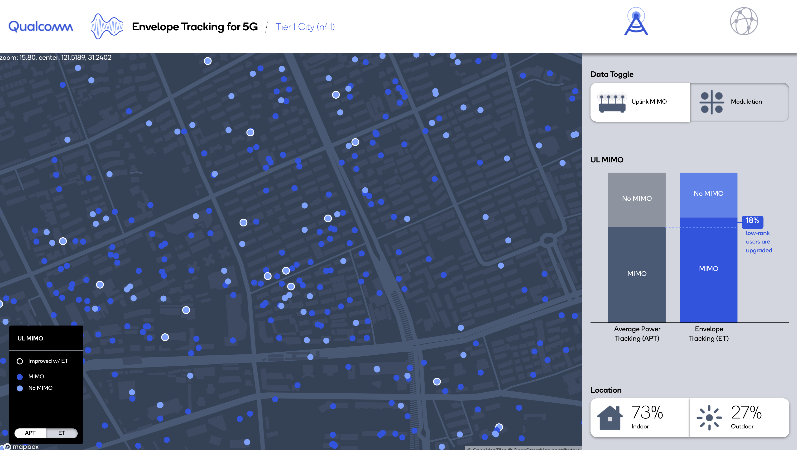
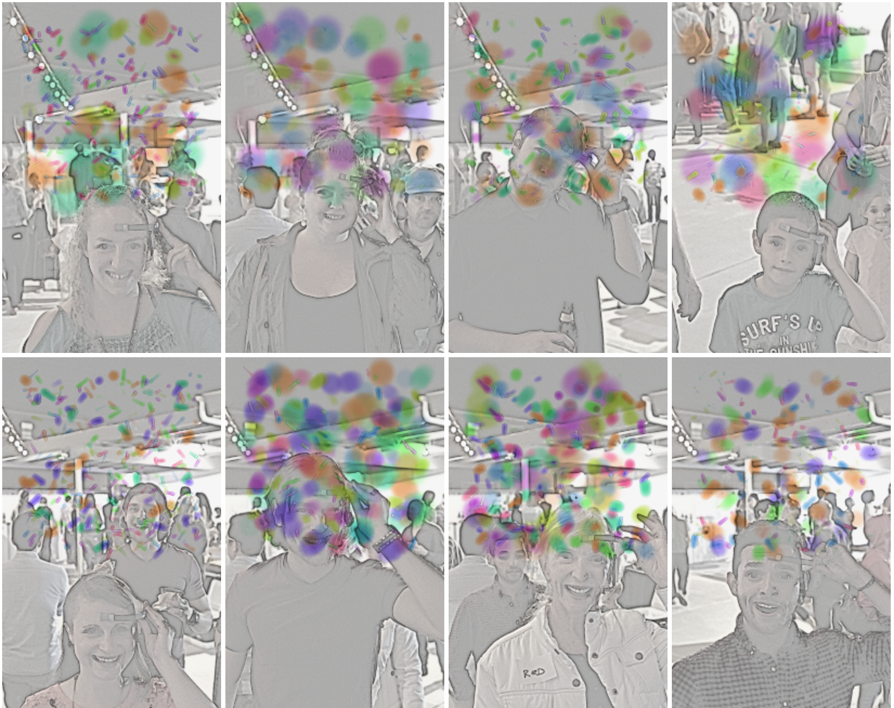

## Project Case Studies
A look at some of the projects that I have worked on and am proud of.

### Qronicles of Invention (Qualcomm)

A patent timeline visualization that shows of Qualcomms large patent portfolio. 
***Challenge:** Visualizing 30,000+ patents in a website.*

##### Approach
- Map out the patent data when building the site
- Only draw a limited number of patents at a given moment

*tools: Javascript, D3.js, WebWorkers, PHP, Node.js, Sql*

### Design Census 2017 (AIGA)

A survey that captures the current state of the design community at large. 
***Challenge:** Create a survey that collects meaningful and qualified data, that was has a custom look and feel.*

##### Approach
- Create a custom form since 3rd party providers didn't allow enough customization
- Push data to 3rd party for quick analysis and backup
- Use node.js with login APIs (Google, Twitter, AIGA)

*tools: Javascript, Node.js, Sass* 
[Design Census - Survey](https://designcensus.sosolimited.com/phasetwo)

### Who's Got Next (Samsung)

An interactive quiz game that was used at a promotional event. 
***Challenge:** Create elaborate animations that make the experience feel less like a website and more like a custom application.*

##### Approach
- Come up with compelling animation in AE that match company branding
- Translate animations to javascript and css

*tools: Adobe After Effects, BodyMovin.js(now Lottie by AirBnb), Javascript, SVGs*

### Envelope Tracking (Qualcomm)

A dashboard application used to help visualize cellular network improvements. 
***Challenge:** Create a polished dashboard map app that also works offline.*

##### Approach
- Create a modular dashboard with an internal state
- Use online/connected map apis and libraries
- Transition to locally hosted map server

*tools: mapbox-gl.js, Vue.js, Tessera(map server), OpenStreetMaps*

### Creative Thinking (personal)

A fun visualization of brain activity. 
***Challenge:** Integrate EEG sensor and DSLR camera into a stylized visualization.*

##### Approach
- Use C++ libraries to capture data from EEG sensor and raw pictures from the camera
- Stylize and visualize data in Openframeworks (C++)
- Use a stencil and watercolor GLSL(OpenGl Shader Language) effect for visualization

*tools: Openframeworks, C++, OpenGl, DSLR camera, NeuroSky EEG sensor*